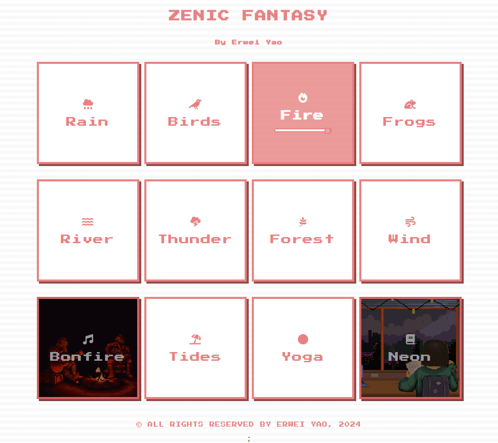

# White Noise Background App

 

## Overview

The White Noise Background App is a user-friendly web application designed to provide ambient sounds to enhance focus, relaxation, and sleep. With a range of different white noise sounds like rain, fire, river, thunder, and more, users can customize their background sound environment to meet their mood and needs.

## Features

- **Multiple Sound Options**: Choose from a variety of sounds, including rain, birds, fire, frogs, river, and many more.
  
- **User-Friendly Interface**: Simple and intuitive design makes it easy for users to play, pause, and adjust the volume of each sound.
  
- **Responsive Design**: The app is built with a mobile-first approach, ensuring smooth functionality on both desktop and mobile devices.

## How to Use

1. Open the app in your preferred browser.
2. Select the white noise sound you'd like to play by clicking on the respective button.
3. Adjust the volume using the slider that appears below the sound's icon.
4. Click on other sounds to mix and match, creating a personalized ambient background.

## Deployment

The app is currently deployed on [GitHub Pages](https://willcoderhz.github.io/white-noise-app).

## Future Improvements

- [ ] Add a timer feature to stop playing after a set duration.
- [ ] Introduce more sounds based on user feedback.
- [ ] Enhance UI/UX for an even smoother user experience.

## Credits

- **Design and Development**: Will Yao
- **Icons**: Provided by FontAwesome

## License

All rights reserved by Will Yao, 2023.
